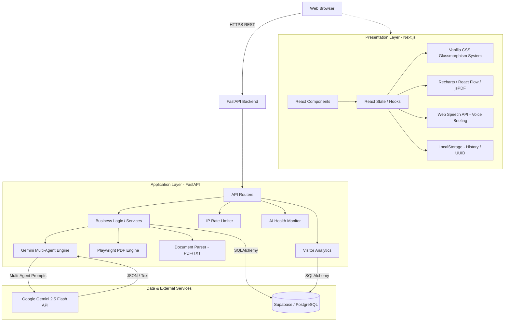
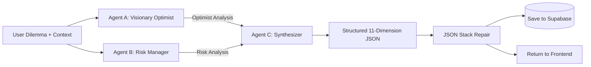
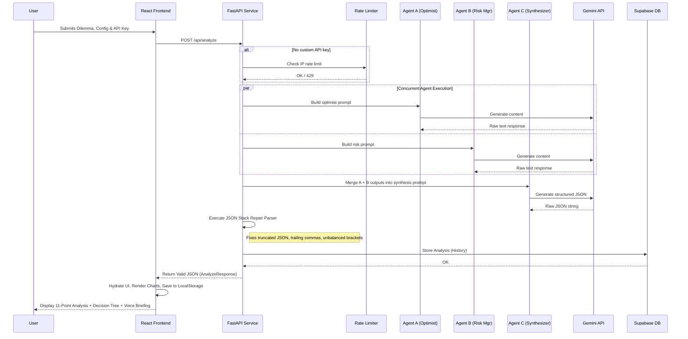
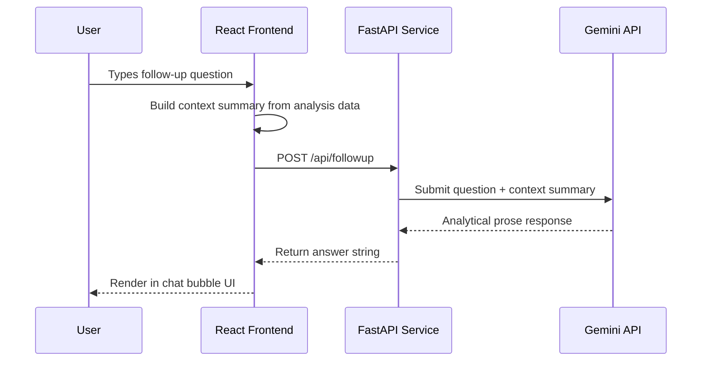
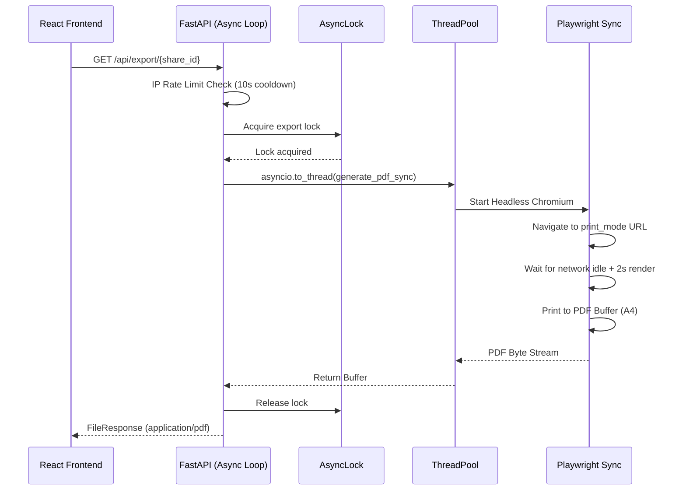
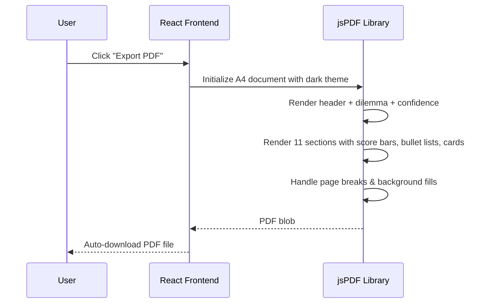
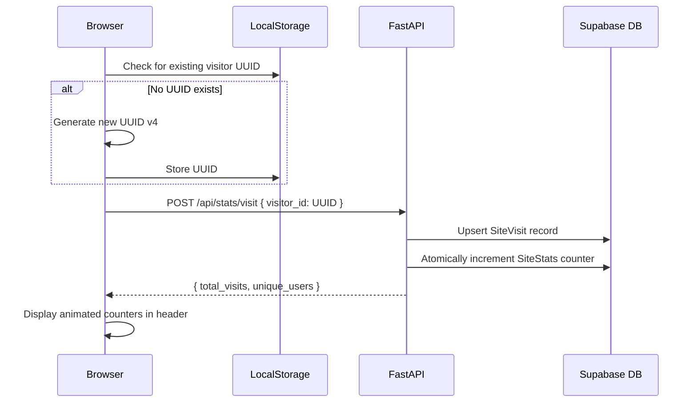
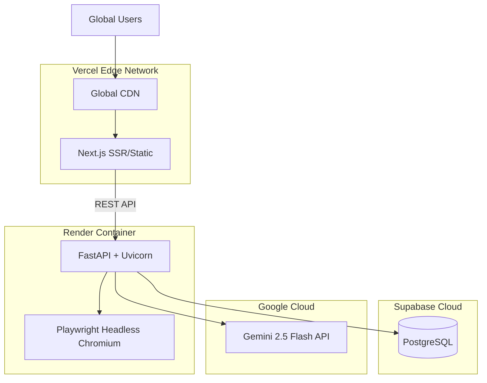

# System Architecture: AI Decision Engine

This document provides a comprehensive overview of the architectural design, components, data flow, and infrastructure of the AI Decision Engine. It is intended for software engineers, system architects, and technical stakeholders.

---

## 1. High-Level Overview

The AI Decision Engine is a completely decoupled client-server architecture. It leverages a modern React-based frontend for rich user interactions and a Python-powered backend built for asynchronous multi-agent AI processing, PDF rendering, visitor analytics, and persistent storage.

---

## 2. Core Components & Technologies

### 2.1 Frontend Architecture (Next.js)
The frontend is designed around performance, zero-dependency styling, and rich interactivity.

- **Framework:** Next.js (React 19) running as a client-side Single Page Application.
- **State Management:** React local state with custom hooks (`useDecisionEngine`, `useHistory`) and Context where necessary.
- **Styling:** Custom "Glassmorphism" design system using Vanilla CSS. No heavy utility frameworks (like Tailwind) are used. Styles are tokenized with CSS custom properties and scoped per component.
- **Data Visualization:** 
  - `Recharts` for plotting Risk & Skill radar charts and Path Comparison bar charts.
  - `React Flow` / `Dagre` for rendering the hierarchical Decision Tree with auto-layout, color-coded nodes, minimap, and interactive controls.
- **PDF Generation (Client-Side):** `jsPDF` for programmatic, dark-themed, multi-section PDF generation (530+ lines of rendering logic).
- **Markdown Export:** Custom `generateMarkdown.js` produces structured 11-section Markdown documents.
- **Text-to-Speech:** Web Speech API integration with multi-language support (English, Hindi, Telugu), smart voice selection (prioritizes Neural/Premium voices), and play/pause/stop controls.
- **URL Compression:** `LZ-String` for compressed URL sharing.
- **API Client:** Axios with interceptors for authentication headers and a 5-minute timeout for long Gemini calls.

### 2.2 Backend Architecture (FastAPI)
The backend acts as an orchestrator between the client, multiple AI agents, the database, and the PDF engine.

- **Framework:** FastAPI running on `uvicorn` for high-performance async processing.
- **AI Core:** Google GenAI SDK (`gemini-2.5-flash`). Three concurrent agents (Visionary Optimist, Pragmatic Risk Manager, and Synthesizer) run via `asyncio.gather()`. The Synthesizer consolidates both perspectives into a structured 11-dimension JSON framework.
- **AI Provider Extensibility:** Anthropic Claude module (`claude.py`) is implemented and ready for multi-provider support.
- **Database ORM:** SQLAlchemy interfacing with Supabase (PostgreSQL). Three models: `Analysis`, `SiteVisit`, `SiteStats`.
- **PDF Generation (Server-Side):** Playwright (Headless Chromium) running in an isolated thread to generate pixel-perfect visual replicas of the analysis without locking the async event loop.
- **Document Parsing:** In-memory PDF (via PyMuPDF) and TXT extraction — no temp files touch disk.
- **Rate Limiting:** In-memory IP-based token bucket (10 req/60s) with per-IP PDF cooldowns (10s).
- **AI Health Monitoring:** Event-driven `AIStatusManager` tracks AI status (`active`, `quota_exceeded`, `offline`, `unknown`) with smart retry backoff windows — zero external polling calls.
- **Visitor Analytics:** Anonymous UUID-based tracking with atomic counter increments.

---

## 3. Multi-Agent AI Pipeline

### 3.1 Agent Architecture

The system employs a **Debate-then-Synthesize** pattern:

| Agent | System Persona | Focus |
|-------|---------------|-------|
| **Agent A** | Visionary Optimist | Exponential growth, leverage, high-agency paths, fulfillment |
| **Agent B** | Pragmatic Risk Manager | Ruin risk, fragility, hidden costs, worst-case scenarios |
| **Agent C** | Synthesizer | Merges both perspectives into balanced, structured framework |

### 3.2 Execution Flow

1. **Agents A & B** run **concurrently** via `asyncio.gather()` with independent Gemini API calls.
2. Their raw text outputs are injected into **Agent C's** system prompt.
3. **Agent C** produces the final structured JSON response adhering to the strict 11-dimension schema.
4. The JSON is validated and repaired (if truncated) via the custom stack parser.
5. The result is persisted to Supabase and returned to the frontend.

### 3.3 Voice Briefing Generation

Agent C also generates a `voiceBriefing` field: a 250–300 word empathetic, mentor-style strategic oration. This is synthesized into audio on the frontend via the Web Speech API with language-appropriate voice selection.

---

## 4. Data Flow Diagrams

### 4.1 Primary Analysis Flow (The Decision Matrix)

When a user submits a decision for analysis, the sequence is highly orchestrated to ensure prompt adherence and JSON structural integrity.

### 4.2 Follow-Up Q&A Flow

### 4.3 PDF Generation Flow (Server-Side)
Due to the heavy nature of headless browsers, PDF generation operates in a thread-safe boundary.

### 4.4 Client-Side PDF Generation Flow

### 4.5 Visitor Analytics Flow

---

## 5. Database Schema Structure

The application requires persistent storage for sharing analyses, viewing history, and tracking visitors. We utilize PostgreSQL via Supabase.

### 5.1 Primary Entity: `analyses`
| Column | Type | Description |
|--------|------|-------------|
| `id` | UUID | Primary Key (auto-generated) |
| `dilemma` | String | User's initial question |
| `data` | JSONB | Complete JSON payload returned from the Synthesizer agent |
| `created_at` | Timestamp | Standard audit field |

This schemaless approach for the `data` column (using `JSONB`) allows the system to remain highly flexible. If the Gemini prompt changes and introduces new fields, the database schema does not require migration.

### 5.2 Visitor Tracking: `site_visits`
| Column | Type | Description |
|--------|------|-------------|
| `visitor_id` | UUID | Primary Key (client-generated, stored in localStorage) |
| `visit_count` | Integer | Total visits from this visitor |
| `first_seen` | Timestamp | First visit timestamp |
| `last_seen` | Timestamp | Most recent visit timestamp (auto-updated) |

### 5.3 Global Counter: `site_stats`
| Column | Type | Description |
|--------|------|-------------|
| `id` | Integer | Primary Key (singleton row, always 1) |
| `total_visits` | Integer | Atomically incremented global visit counter |

---

## 6. API Surface

### Core Endpoints

| Method | Endpoint | Description |
|--------|----------|-------------|
| `POST` | `/api/analyze` | Submit dilemma for multi-agent analysis |
| `POST` | `/api/followup` | Ask context-aware follow-up questions |
| `POST` | `/api/upload-context` | Upload PDF/TXT for context extraction |
| `GET` | `/api/health` | Event-driven AI status (no external calls) |
| `POST` | `/api/health/reset` | Manual AI status reset |
| `GET` | `/api/usage` | Rate limit remaining for current IP |

### Share & Export

| Method | Endpoint | Description |
|--------|----------|-------------|
| `POST` | `/api/share` | Save analysis and get share UUID |
| `GET` | `/api/share/{id}` | Retrieve shared analysis by UUID |
| `GET` | `/api/export/{id}` | Generate and download PDF via Playwright |

### Analytics

| Method | Endpoint | Description |
|--------|----------|-------------|
| `POST` | `/api/stats/visit` | Record a visitor (UUID-based) |
| `GET` | `/api/stats` | Get total visits and unique users |

---

## 7. Deployment Topology

The system uses a completely distributed cloud-native deployment model.

- **Vercel (Frontend Network):** The Next.js client is deployed to Vercel's Edge Network for global CDN distribution, fast TTFB, and serverless routing.
- **Render (Backend Engine):** The FastAPI application runs inside an ephemeral Linux container. Render manages port binding, custom health checks, and automatic instance scaling.
- **Supabase (Storage & DB):** A managed PostgreSQL instance housing the analysis data and visitor analytics. Connection pooling is managed by SQLAlchemy in the backend.
- **Google Gemini API:** External AI service for the three-agent reasoning pipeline.

---

## 8. Security & Boundary Definitions

- **CORS Configuration:** The backend explicitly whitelists the Vercel domain and `localhost` origins. No external domains can perform API calls.
- **Rate Limiting:** IP-based token bucket rate limiting surrounds the `/analyze` and `/followup` endpoints (10 req/60s) to defend against abuse of the backend's AI credentials. User-supplied keys bypass this mechanism entirely. PDF exports have an additional per-IP 10-second cooldown.
- **Async Locking:** A global `asyncio.Lock()` prevents multiple simultaneous Chromium browser launches, protecting server resources.
- **Sanitization:** All file inputs are converted strictly to raw text representations via in-memory processing. The system performs no code execution or direct file rendering of user uploads. No temporary files are written to disk.
- **API Key Handling:** User-provided API keys are passed per-request and never stored server-side. They are used only for the duration of the Gemini API call.
- **Anonymous Analytics:** Visitor tracking uses client-generated UUIDs (stored in localStorage). No cookies, no personal data, no IP logging for analytics purposes.
- **Event-Driven Health Checks:** The `/api/health` endpoint reads from an in-memory singleton — it never makes external API calls, preventing accidental quota consumption.
