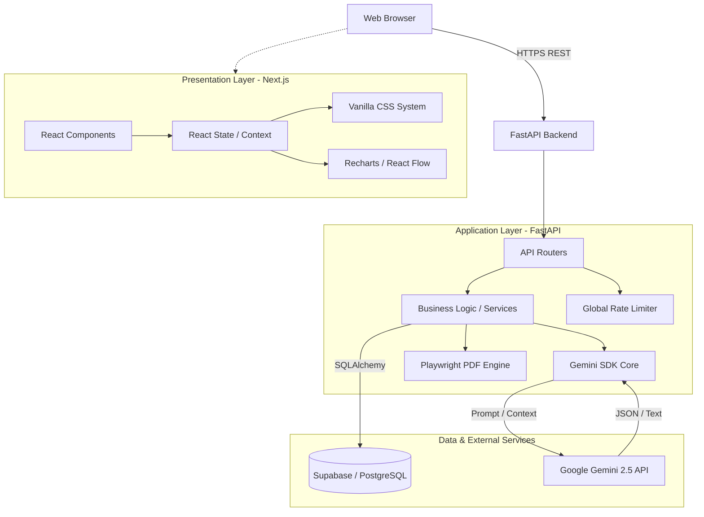
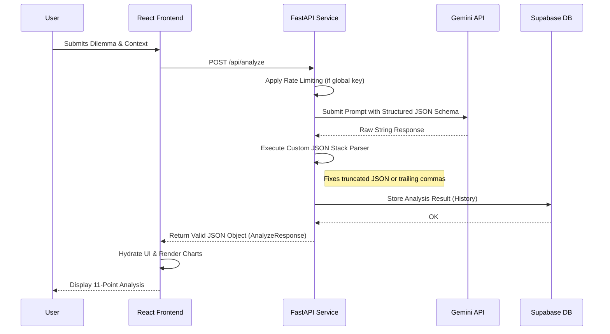
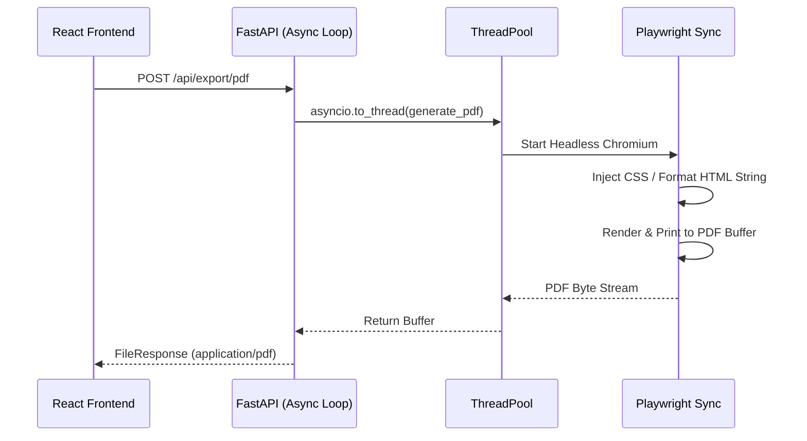

# System Architecture: AI Decision Engine

This document provides a comprehensive overview of the architectural design, components, and data flow of the AI Decision Engine. It is intended for software engineers, system architects, and technical stakeholders.

---

## 1. High-Level Overview

The AI Decision Engine is a completely decoupled client-server architecture. It leverages a modern React-based frontend for rich user interactions and a Python-powered backend built for asynchronous AI processing, PDF rendering, and persistent storage.

---

## 2. Core Components & Technologies

### 2.1 Frontend Architecture (Next.js)
The frontend is designed around performance and zero-dependency styling.
- **Framework:** Next.js (React 19) running as a static Single Page Application or SSR client.
- **State Management:** React local state layered with context where necessary. 
- **Styling:** Custom "Glassmorphism" design system using Vanilla CSS. No heavy utility frameworks (like Tailwind) are used. Styles are tokenized and scoped.
- **Data Visualization:** 
  - `Recharts` for plotting Risk & Skill radar charts.
  - `React Flow` / `Dagre` for rendering the hierarchical Decision Tree matrix.

### 2.2 Backend Architecture (FastAPI)
The backend acts as an orchestrator between the client, the AI model, and the database.
- **Framework:** FastAPI running on `uvicorn` for high-performance async processing.
- **AI Core:** Google GenAI SDK (`gemini-2.5-flash`). Chosen for its speed, huge context window (for document parsing), and structured JSON output capabilities.
- **Database ORM:** SQLAlchemy interfacing with Supabase (PostgreSQL).
- **PDF Generation:** Playwright (Headless Chromium) running in an isolated thread to generate precise visual replicas of the analysis without locking the async event loop.

---

## 3. Data Flow Diagrams

### 3.1 Primary Analysis Flow (The Decision Matrix)

When a user submits a decision for analysis, the sequence is highly orchestrated to ensure prompt adherence and JSON structural integrity.

### 3.2 PDF Generation Flow
Due to the heavy nature of headless browsers, PDF generation operates in a thread-safe boundary.

---

## 4. Database Schema Structure

The application requires persistent storage for sharing analyses and viewing history. We utilize PostgreSQL via Supabase.

**Primary Entity: `analyses`**
| Column | Type | Description |
|--------|------|-------------|
| `id` | UUID | Primary Key (auto-generated) |
| `dilemma` | String | User's initial question |
| `context_summary` | String | Aggregated context (files + text) |
| `analysis_data` | JSONB | Complete JSON payload returned from Gemini |
| `created_at` | Timestamp | Standard audit field |

This schemaless approach for the `analysis_data` column (using `JSONB`) allows the system to remain highly flexible. If the Gemini prompt changes and introduces new fields, the database schema does not require migration.

---

## 5. Deployment Topology

The system uses a completely distributed cloud-native deployment model.

- **Vercel (Frontend Network):** The Next.js client is deployed to Vercel's Edge Network for global CDN distribution, fast TTFB, and serverless routing.
- **Render (Backend Engine):** The FastAPI application runs inside an ephemeral Linux container. Render manages port binding, custom health checks, and automatic instance scaling.
- **Supabase (Storage & DB):** A managed PostgreSQL instance housing the data. Connection pooling is managed by SQLAlchemy in the backend.

## 6. Security & Boundary Definitions

- **CORS Configuration:** The backend explicitly whitelists the Vercel domain and `localhost:5173`. No external domains can perform API calls.
- **Rate Limiting:** IP-based token bucket rate limiting surrounds the `/analyze` and `/followup` endpoints to defend against abuse of the backend's AI credentials. User-supplied keys bypass this mechanism entirely.
- **Sanitization:** All file inputs are converted strictly to raw text representations. The system performs no code execution or direct file rendering of user uploads.
