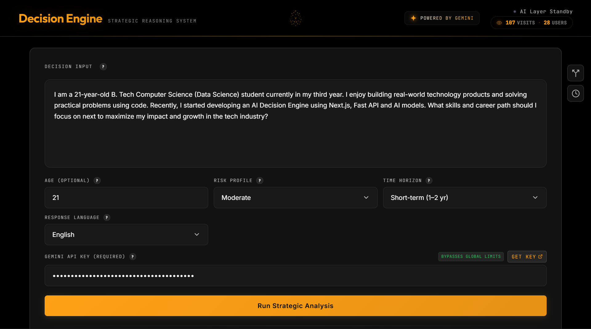

# 🧠 AI Decision Engine

An advanced multi-agent AI framework engineered to structure complex life and strategic decisions using quantified risk modeling, regret minimization, and structured synthesis.

> This is not a wrapper around an LLM.  
> This is a structured cognitive architecture.

---



---

# 🌍 Live Architecture

Frontend (Next.js) → FastAPI Backend → Gemini AI (Multi-Agent) → Neon (PostgreSQL) → Playwright PDF Engine

---

# 🎯 Vision

Most people make major life decisions emotionally.

This system forces structured reasoning by:

- Surfacing hidden assumptions
- Mapping opportunity costs
- Quantifying ruin risk
- Applying regret minimization
- Modeling long-term antifragility
- Detecting cognitive biases
- Running multi-agent debate (Optimist vs Risk Manager vs Synthesizer)

Designed for founders, engineers, and decision-makers facing high-stakes crossroads.

---

# 👨‍💻 About the Creator

Hi, I'm **Dharshan Sondi**.

I built this because I was frustrated with vague AI responses like:

> "Follow your passion."

I wanted AI that thinks like:
- A venture capitalist
- A risk strategist
- A McKinsey consultant
- A long-term systems thinker

So I built a three-agent reasoning engine.

---

# 🧠 Three-Agent AI Architecture

| Agent | Role | Responsibility |
|-------|------|----------------|
| 🏃 Visionary | Upside Maximizer | Explores leverage, optionality, asymmetry |
| 🛡 Risk Manager | Downside Protector | Detects ruin risk, fragility, hidden traps |
| ⚖ Synthesizer | Decision Architect | Consolidates reasoning into structured 11-point framework |

Both the **Visionary** and **Risk Manager** agents run concurrently via `asyncio.gather()`. Their outputs are then fed into the **Synthesizer**, which produces the final structured JSON analysis covering all 11 dimensions.

---

# ✨ Complete Feature List

## 🤖 Core AI Features

| # | Feature | Description |
|---|---------|-------------|
| 1 | **Multi-Agent Analysis** | Three concurrent AI agents (Optimist, Risk Manager, Synthesizer) debate and produce a unified decision framework |
| 2 | **11-Dimension Analysis** | Every decision is evaluated across 11 structured dimensions (see framework below) |
| 3 | **AI Follow-Up Chat** | Context-aware follow-up Q&A system with smart suggestions based on your analysis |
| 4 | **Custom JSON Schema Output** | Strict JSON schema enforcement ensures consistent, parseable AI outputs every time |
| 5 | **Custom Stack-Based JSON Repair** | Multi-strategy parser fixes truncated/malformed LLM responses - guarantees valid JSON to frontend |
| 6 | **Multi-Language Support** | Analysis output in English, Hindi (हिन्दी), and Telugu (తెలుగు) |
| 7 | **Configurable Risk Profiles** | Conservative, Moderate, Aggressive, and Contrarian analysis modes |
| 8 | **Time Horizon Calibration** | Short-term (1–2 yr), Medium-term (3–5 yr), Long-term (5–10+ yr) decision framing |
| 9 | **Context-Aware Age Calibration** | User age calibrates risk tolerance and timeline recommendations |
| 10 | **Document Context Upload** | Upload PDF/TXT files to provide additional context for the analysis |

## 📊 Data Visualization

| # | Feature | Description |
|---|---------|-------------|
| 11 | **Risk Radar Chart** | Interactive Recharts radar visualization of risk scores across all identified risk factors |
| 12 | **Skill Gap Radar** | Radar chart comparing required vs current skills with gap analysis |
| 13 | **Path Comparison Bar Chart** | Side-by-side comparison of strategic paths by success probability |
| 14 | **Interactive Decision Tree** | React Flow + Dagre auto-layouted decision tree with color-coded nodes, minimap, and zoom controls |
| 15 | **Real-Time Score Displays** | Animated score meters for Confidence, Antifragility, Ruin Risk, and Skill Gap |

## 🗣️ Voice & Audio

| # | Feature | Description |
|---|---------|-------------|
| 16 | **Text-to-Speech Voice Briefing** | AI-generated `voiceBriefing` field narrated via Web Speech API with play/pause/stop controls |
| 17 | **Multi-Language TTS** | Voice synthesis supports English, Hindi, and Telugu with smart voice selection |
| 18 | **Premium Voice Selection** | Prioritizes Natural/Neural/Premium voices for professional-grade audio output |

## 📤 Export & Sharing

| # | Feature | Description |
|---|---------|-------------|
| 19 | **Client-Side PDF Export** | Professional multi-page PDF generated via jsPDF with dark-theme styling, section headers, risk bars, and score displays |
| 20 | **Server-Side PDF Export** | Playwright (Headless Chromium) renders pixel-perfect PDF replicas of the web analysis |
| 21 | **Markdown Export** | Full 11-section structured Markdown export with tables, headers, and formatted data |
| 22 | **Shareable Links** | One-click share creates a persistent link (backed by Neon) that anyone can open to view the analysis |
| 23 | **Copy-to-Clipboard** | Per-section copy buttons for quick extraction of individual analysis sections |

## 🧭 Navigation & UX

| # | Feature | Description |
|---|---------|-------------|
| 24 | **Analysis History** | LocalStorage-backed history panel - revisit, restore, or delete past analyses |
| 25 | **Compare Mode** | Side-by-side analysis comparison panel - run two dilemmas simultaneously and compare results |
| 26 | **Skeleton Loading Animation** | Multi-section skeleton loader with shimmer effect during analysis |
| 27 | **Agent Loading Steps** | Real-time step-by-step progress indicators showing which AI agent is currently processing |
| 28 | **Neural Brain Animation** | Animated SVG brain with orbital rings, traveling dots, and neural connections (speeds up during loading) |
| 29 | **Confetti Celebration** | Particle confetti animation on successful analysis completion |
| 30 | **Keyboard Shortcuts** | `Ctrl+Enter` to analyze, `Ctrl+N` for new analysis, `Ctrl+H` for history |
| 31 | **Scroll-to-Top Button** | Appears on scroll for quick navigation back to the top |
| 32 | **Collapsible Sections** | Each of the 11 analysis sections is independently collapsible |
| 33 | **Example Dilemmas** | Pre-loaded example prompts to help users get started quickly |
| 34 | **First-Time Onboarding** | Auto-opening About Modal for new users with tabbed walkthrough |

## 🔐 API & Rate Limiting

| # | Feature | Description |
|---|---------|-------------|
| 35 | **BYOK (Bring Your Own Key)** | Users can inject their own Gemini API key to bypass global rate limits entirely |
| 36 | **Global Rate Limiter** | IP-based in-memory token bucket - 10 requests per 60s window |
| 37 | **PDF Export Rate Limiter** | Per-IP cooldown (10s) for PDF generation to prevent Chromium abuse |
| 38 | **AI Status Health Monitor** | Event-driven health tracking (`active`, `quota_exceeded`, `offline`, `unknown`) - no polling API calls |
| 39 | **Quota Exceeded Alert** | Full-screen modal with step-by-step API key creation guide when quota is hit |
| 40 | **Invalid Key Alert** | Clear error modal distinguishing invalid keys from exhausted quotas |
| 41 | **Rate Limit Usage API** | `/api/usage` endpoint shows remaining requests for the current window |
| 42 | **Health Reset Endpoint** | `/api/health/reset` for manual AI status reset after key changes |

## 📈 Analytics & Tracking

| # | Feature | Description |
|---|---------|-------------|
| 43 | **Anonymous Visitor Tracking** | UUID-based visitor identification (stored in localStorage) - no cookies, no personal data |
| 44 | **Site Visit Counter** | Real-time total visits and unique users displayed in the header with animated number transitions |
| 45 | **Atomic Counter Increment** | Thread-safe atomic counter for concurrent visit tracking |

## 🎨 Design System

| # | Feature | Description |
|---|---------|-------------|
| 46 | **Glassmorphism UI** | Custom design system using `backdrop-filter: blur`, layered gradients, and glass-panel effects |
| 47 | **Dark Theme** | Full dark mode with tokenized CSS variables (`--bg`, `--surface`, `--accent`, etc.) |
| 48 | **Zero Layout Shift Tooltips** | Viewport-aware, absolute-positioned `HelpIcon` component prevents scroll/layout jumps |
| 49 | **Micro-Animations** | Custom cubic-bezier transitions on hover, focus, and state changes throughout the UI |
| 50 | **Custom Select Dropdowns** | Styled dropdown replacements matching the design system |
| 51 | **Responsive Layout** | Two-column layout (Input + Output) adapts to all screen sizes |
| 52 | **Toast Notifications** | Lightweight toast system for success/error feedback |

## 🏗️ Backend Infrastructure

| # | Feature | Description |
|---|---------|-------------|
| 53 | **Thread-Isolated PDF Generation** | Playwright runs via `asyncio.to_thread()` to avoid Windows async pipe crashes |
| 54 | **Async Lock for Chromium** | `asyncio.Lock()` prevents multiple simultaneous browser launches |
| 55 | **Structured Request Logging** | Every request logs method, path, status code, and duration in ms |
| 56 | **Document Parser Service** | In-memory PDF/TXT extraction - no temp files touch disk |
| 57 | **Claude Integration (Reserved)** | Anthropic Claude module ready for multi-provider AI support |
| 58 | **Auto Database Migration** | `Base.metadata.create_all()` on startup - tables auto-create |
| 59 | **Print Template** | Server-rendered print-optimized template for Playwright PDF capture |
| 60 | **Error Boundary** | React ErrorBoundary component catches and displays rendering failures gracefully |

---

# 🏗️ Tech Stack

## Frontend

- Next.js (React 19)
- Vanilla CSS (Custom Glassmorphism Design System)
- Recharts (Radar Risk & Skill Visualization)
- React Flow + Dagre (Decision Trees)
- jsPDF (Client-Side PDF Generation)
- LZ-String (URL Compression)
- Lucide React (Icons)
- Axios (API Client)

## Backend

- FastAPI (Python 3.10+)
- Google Gemini SDK (`gemini-2.5-flash`)
- Anthropic Claude SDK (ready for multi-provider)
- SQLAlchemy ORM
- Neon (PostgreSQL)
- Playwright (Headless Chromium for PDF Export)
- PyMuPDF (PDF Document Parsing)

---

# 🔥 Engineering Challenges Solved

## 1️⃣ AI JSON Truncation

### Problem
LLM responses occasionally truncated mid-output → invalid JSON → server crash.

### Solution
Built a custom stack-based JSON repair parser:

- Walks backwards through the response
- Closes dangling quotes
- Balances `{}` and `[]`
- Replaces incomplete keys with `null`
- Strips trailing commas before closing brackets

Guarantees valid JSON payload to frontend.

---

## 2️⃣ Async + Playwright Event Loop Crash

### Problem
On Windows + Python 3.14:
```
ValueError: I/O operation on closed pipe
```

### Solution

- Isolated PDF logic in a dedicated router module
- Used `sync_playwright()` instead of async
- Wrapped inside `asyncio.to_thread()` for true thread isolation
- Added `asyncio.Lock()` to prevent concurrent Chromium launches
- Prevented event loop contamination

Stable under concurrency.

---

## 3️⃣ Global Gemini Rate Limiting

### Problem
Shared API key → quota exhaustion under public usage.

### Solution

- In-memory IP-based rate limiter (token bucket: 10 req/60s)
- User-level BYOK (Bring Your Own Key) override
- Frontend custom API key injection with "Get Key" link
- Event-driven AI health status tracking with smart quota backoff
- Prominent quota-exceeded alerts with step-by-step API key creation guide

Prevents full system lockout while empowering advanced users.

---

## 4️⃣ Zero Layout Shift Tooltips

Standard tooltips caused scroll jumps.

Built viewport-aware, absolute-positioned custom tooltip system using `useRef` bounding box measurement.

Zero layout shift guaranteed.

---

# 🗄️ Database Schema

## Table: `analyses`

| Column | Type | Description |
|--------|------|------------|
| id | UUID | Primary Key (auto-generated) |
| dilemma | TEXT | User's initial question |
| data | JSONB | Complete structured AI output |
| created_at | TIMESTAMP | Auto timestamp |

## Table: `site_visits`

| Column | Type | Description |
|--------|------|------------|
| visitor_id | UUID | Primary Key (client-generated) |
| visit_count | INTEGER | Total visits by this user |
| first_seen | TIMESTAMP | First visit time |
| last_seen | TIMESTAMP | Last visit time |

## Table: `site_stats`

| Column | Type | Description |
|--------|------|------------|
| id | INTEGER | Primary Key (singleton row) |
| total_visits | INTEGER | Global visit counter |

---

# 🧩 AI Output Framework (11 Dimensions)

| # | Component | Description |
|---|-----------|-------------|
| 1 | Problem Framing | Core decision, hidden assumptions, decision type & horizon |
| 2 | Constraints Mapping | Financial, geographic, skill-based, psychological, and time constraints |
| 3 | Risk Analysis | Named risks with severity scores (0–100), levels, and descriptions |
| 4 | Opportunity Cost | Lost salary, experience, optionality, and social capital |
| 5 | Skill Delta | Required vs current skills, gap score, learning timeline, critical gaps |
| 6 | Strategic Paths | Multiple paths with success probability, timeline, reversibility, best/worst case |
| 7 | Probabilistic Model | Short-term, mid-term, and long-term outcome probabilities |
| 8 | Recommendations | Most rational, most aggressive, most conservative, older-self view, high-agency view |
| 9 | Cognitive Bias Detection | Named biases with descriptions and mitigation strategies |
| 10 | Antifragility Score | Overall score with optionality, upside asymmetry, stress resilience, and learning dimensions |
| 11 | Regret Minimization | At-80 analysis, primary regret risk, and final recommendation |

**Bonus Outputs:**
- `voiceBriefing` - 250–300 word empathetic mentor-style strategic oration
- `confidenceScore` - Overall analysis confidence (0–100)
- `confidenceNote` - Explanation of confidence level
- `decisionTree` - Nodes and edges for interactive React Flow visualization

---

# 📂 Project Structure

```
decision-engine/
│
├── frontend/
│   ├── src/
│   │   ├── app/
│   │   │   ├── layout.jsx          # Root layout with metadata & fonts
│   │   │   ├── page.jsx            # Main application page (450+ lines)
│   │   │   └── error.jsx           # Error boundary page
│   │   ├── components/
│   │   │   ├── Header.jsx          # Logo, AI status, site stats, about modal
│   │   │   ├── InputPanel.jsx      # Dilemma input, config fields, API key
│   │   │   ├── OutputPanel.jsx     # Loading states, results wrapper
│   │   │   ├── Results.jsx         # 11-section collapsible analysis display
│   │   │   ├── FollowUp.jsx        # AI follow-up chat with suggestions
│   │   │   ├── ComparePanel.jsx    # Side-by-side analysis comparison
│   │   │   ├── HistoryPanel.jsx    # Analysis history overlay
│   │   │   ├── SidebarActions.jsx  # Floating compare/history buttons
│   │   │   ├── DecisionTree.jsx    # React Flow decision tree visualization
│   │   │   ├── TextToSpeech.jsx    # Voice briefing with play/pause/stop
│   │   │   ├── NeuralBrain.jsx     # Animated SVG brain logo
│   │   │   ├── AboutModal.jsx      # Tabbed about/onboarding modal
│   │   │   ├── ApiKeyAlert.jsx     # Quota/key error alert modal
│   │   │   ├── SkeletonLoader.jsx  # Loading skeleton with shimmer
│   │   │   ├── PrintTemplate.jsx   # Server-side PDF print template
│   │   │   ├── HelpIcon.jsx        # Zero-shift viewport-aware tooltips
│   │   │   ├── CopyButton.jsx      # Clipboard copy with feedback
│   │   │   ├── CustomSelect.jsx    # Styled dropdown component
│   │   │   ├── Confetti.jsx        # Success celebration particles
│   │   │   ├── Toast.jsx           # Notification toasts
│   │   │   ├── ErrorBoundary.jsx   # React error boundary
│   │   │   ├── charts/
│   │   │   │   ├── SkillRadar.jsx        # Skill gap radar chart
│   │   │   │   └── PathComparisonChart.jsx # Path comparison bar chart
│   │   │   └── sections/
│   │   │       ├── AnalysisSections.jsx  # Probabilistic, Recommendations, Bias, Antifragility
│   │   │       ├── PathsSection.jsx      # Strategic paths display
│   │   │       └── RiskSection.jsx       # Risk analysis display
│   │   ├── hooks/
│   │   │   ├── useDecisionEngine.js # Core analysis logic & state
│   │   │   └── useHistory.js        # LocalStorage history management
│   │   ├── lib/
│   │   │   ├── api.js              # Axios API client + all API functions
│   │   │   ├── generatePDF.js      # Client-side jsPDF generation (530 lines)
│   │   │   └── generateMarkdown.js # Markdown export generator
│   │   └── styles/
│   │       └── globals.css         # Full design system (glassmorphism, tokens)
│   └── vercel.json
│
├── backend/
│   ├── app/
│   │   ├── api/
│   │   │   └── routes.py           # Main API routes (analyze, followup, health, upload)
│   │   ├── core/
│   │   │   ├── gemini.py           # Gemini multi-agent engine (3 agents + JSON repair)
│   │   │   ├── claude.py           # Anthropic Claude integration (reserved)
│   │   │   ├── ai_status.py        # Event-driven AI health tracker
│   │   │   ├── rate_limit.py       # IP-based in-memory rate limiter
│   │   │   └── config.py           # Settings & environment config
│   │   ├── routers/
│   │   │   ├── export.py           # PDF export via Playwright
│   │   │   ├── share.py            # Analysis sharing (save/retrieve)
│   │   │   └── stats.py            # Anonymous visitor tracking
│   │   ├── services/
│   │   │   ├── analyzer.py         # Analysis orchestrator
│   │   │   └── document_parser.py  # PDF/TXT text extraction
│   │   ├── models/
│   │   │   └── schemas.py          # Pydantic request/response models
│   │   ├── database.py             # SQLAlchemy engine & session
│   │   ├── db_models.py            # ORM models (Analysis, SiteVisit, SiteStats)
│   │   └── main.py                 # FastAPI app + middleware + startup
│   ├── requirements.txt
│   └── render.yaml
│
├── README.md
├── Architecture.md
├── CodebaseReadme.md
└── System Design.md
```

---

# 🚀 Local Development Setup

## Backend

```bash
cd backend
python -m venv venv
venv\Scripts\activate  # Windows
source venv/bin/activate  # Mac/Linux

pip install -r requirements.txt
playwright install chromium --with-deps
```

Create `.env`:

```
GEMINI_API_KEY=your_key
Neon_URL=your_url
Neon_KEY=your_key
ALLOWED_ORIGINS=http://localhost:3000
```

Run:

```
uvicorn app.main:app --reload
```

Backend runs on:
```
http://localhost:8000
```

API docs at: `http://localhost:8000/api/docs`

---

## Frontend

```
cd frontend
npm install
```

Create `.env.local`:

```
NEXT_PUBLIC_API_URL=http://localhost:8000
```

Run:

```
npm run dev
```

Frontend runs on:
```
http://localhost:3000
```

---

# 🌍 Production Deployment

## Backend → Render

1. Push repo to GitHub
2. Create Web Service
3. Root directory: `backend`
4. Build command:

```
pip install -r requirements.txt && playwright install chromium
```

5. Start command:

```
uvicorn app.main:app --host 0.0.0.0 --port $PORT
```

6. Add environment variables in Render dashboard:

```
GEMINI_API_KEY=...
Neon_URL=...
Neon_KEY=...
ALLOWED_ORIGINS=https://your-vercel-domain.vercel.app
```

---

## Frontend → Vercel

1. Import GitHub repo
2. Root directory: `frontend`
3. Add environment variable:

```
NEXT_PUBLIC_API_URL=https://your-render-backend.onrender.com
```

Deploy.

---

# 🧪 Production Test Checklist

- [ ] Submit a dilemma and confirm analysis renders correctly
- [ ] Confirm request hits Render backend (check logs)
- [ ] Confirm Gemini processes all three agents successfully
- [ ] Confirm Neon writes analysis record
- [ ] Confirm JSON repair handles truncated output
- [ ] Test PDF export (both client-side and server-side)
- [ ] Test Markdown export downloads correctly
- [ ] Test share link creates and retrieves analysis
- [ ] Test follow-up Q&A with context-aware responses
- [ ] Test Text-to-Speech voice briefing
- [ ] Test Compare Mode with two simultaneous analyses
- [ ] Test history save/restore/delete
- [ ] Test BYOK API key bypass
- [ ] Confirm site stats (visits/users) display and increment
- [ ] Test keyboard shortcuts (Ctrl+Enter, Ctrl+N, Ctrl+H)

---

# 🧠 Why This Is Different

Standard LLM:
> "Do what makes you happy."

Decision Engine:
> "Path A has 45% upside probability but 8/10 ruin risk. Path B maximizes long-term antifragility with 72% confidence."

This is structured decision architecture - not conversation, but computation.

---

# 🛣️ Roadmap

- [ ] Multi-provider AI support (OpenAI, Anthropic Claude)
- [ ] User authentication & cloud history
- [ ] Team/collaborative decision analysis
- [ ] Mobile-responsive PWA
- [ ] Real-time streaming AI responses
- [ ] Decision outcome tracking & feedback loop

---

# 🤝 Open for Collaboration

If you'd like to:

- Add OpenAI/Anthropic support
- Implement user authentication
- Improve AI workflow
- Build mobile version
- Contribute optimizations

Open a PR or Issue.

---

# 📬 Contact

Dharshan Sondi  
Email: dharshansondi.dev@gmail.com  
LinkedIn: https://www.linkedin.com/in/dharshansondi/

---

Built with conviction.  
Engineered for clarity.  
Designed for high-stakes decisions.
